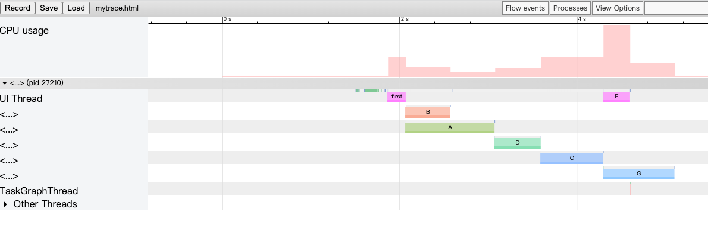

# TaskGraph

简体中文 | [English](./README_EN.md)


这是一个面向Android开发的依赖任务启动框架，致力于帮助广大Android开发者降低开发成本，它可以使用在启动优化中。

## 引用

[](https://search.maven.org/artifact/io.github.jonanorman.android/taskgraph)

```
implementation('io.github.jonanorman.android:taskgraph:0.1.0')
```

## 使用
### 初始化
必须在Application的onCreate中执行，要不然TaskGraphModule.getTopActivity()会错误
```Java
TaskGraphModule.initApplication(appliction);
```

### 构建

```Java
TaskGraph taskGraph = new TaskGraph();
taskGraph.addTask(new Task("A",new Runnable() {//添加A任务
    @Override
    public void run() {
    }
}).addTaskInterceptor(new Task.TaskInterceptor() {
    @Override
    public void onIntercept(Task.TaskInterceptorChain interceptorChain) {//拦截A任务，在A任务之前可以插入交互性的任务
        interceptorChain.proceed();
    }
}));
taskGraph.addTask(new Task("B",new Runnable() {
    @Override
    public void run() {//添加B任务,B任务依赖A任务先完成
    }
}).dependsOn("A").setMainThread(true));
TaskGraphExecutor.getDefault().execute(taskGraph);
```


### 日志

默认的日志Tag是TASK_GRAPH_LOG，搜索TASK_GRAPH_LOG: graphviz:会输出任务的graphviz的有向图日志，复制到 [graphviz-visual-editor](http://magjac.com/graphviz-visual-editor/) 可视化查看


### 运行跟踪

```shell
python systrace.py -o trace.html  -a packagename sched
```
packagename要替换成运行的app的包名
chrome浏览器打开chrome://tracing/,load 按钮加载trace.html



## 文档
### Task
构造函数中传入runnable或者复写Task的run方法
- **setName**

    设置任务名字，可传可不传，不传默认用Task-Num作为名字
- **setMainThread**

    设置是否在主线程中运行，默认false
- **setOnlyMainProcess** 

    是否只运行在主进程 默认true
- **addTaskListener**

    设置任务回调，TaskListener的doFirst表示任务执行前并且拦截任务继续执行之后执行，doLast表示任务执行成功之后执行
- **removeTaskInterceptor** 

    移除任务回调
- **clearTaskInterceptor**

    清除任务回调
- **dependsOn**

    依赖任务，假设B需要A执行以后才能执行，那么就B.dependsOn(A),可传String、Task以及他们的数组
- **clearDepends** 

    清除依赖
- **addTaskInterceptor** 

    添加任务拦截器，TaskInterceptor的onIntercept在该任务执行之前执行，调用TaskInterceptorChain的cancel方法表示取消该任务，则所有未执行任务取消，调用TaskInterceptorChain的proceed方法表示继续执行，必须执行其中之一，否者会一直等待
- **removeTaskInterceptor** 

    移除任务拦截器

### TaskGraph

- **addTask** 

    添加任务
- **removeTask** 

    移除任务
- **setFirstTask** 

    设置第一个任务，可传可不传
- **setLastTask** 

    设置最后一个任务，可传可不传
- **clearTask** 

  清空任务，不清除FirstTask和LastTask
- **addTaskGraphListener** 

    添加任务图回调，TaskGraphListener的onTaskGraphStart表示在所有任务执行前执行，onTaskGraphEnd表示所有任务执行成功后执行，onTaskGraphCancel表示任务执行取消后执行
- **removeTaskGraphListener**

    移除任务图回调
- **clearTaskGraphListener** 

    清空任务图回调
- **execute** 

    执行，用TaskGraphExecutor.getDefault()执行，也可以new TaskGraphExecutor()来执行

### TaskGraphExecutor
- **getDefault** 

    默认执行器
- **setCoreThreadPoolSize** 

    设置线程池核心数
- **setMaximumPoolSize**

    设置线程池最大数量
- **getThreadPoolExecutor**

    获取线程池
- **execute** 

    传入TaskGraph对象执行，如果执行中TaskGraph对象改变还是会执行原先的对象设置内容，保证执行可靠性

### TaskGraphModule
模块设置器
- **isMainProcess**

    是否是主进程
- **isMainThread**

    是否是主线程
- **getProcessName**

    获取进程名
- **getApplication** 

    获取Application
- **initApplication**

    初始化，在Application的onCreate中调用
- **setLogFunction**

    设置LogFunction
- **setEnableTrace** 

    是否开启Systrace跟踪，默认开启
- **getPackageName**

    获取包名
- **setLogGraphViz** 

    是否开启输出GraphViz有向图日志，默认开启
- **getTopActivity**

    获取当前最上面的Activity
- **runInMainThread**
    
    在主线程中执行，如果当前线程就是主线程立即执行
- **addTopActivityListener**
    
    添加监听器，监听最上面的activity的变化
- **removeTopActivityListener**

    移除监听器
- **getRecentActivity** 

    获取最近的activity，如果已经存在，就直接在主线程中回调返回，如果不存在就等到存在activity在返回


## 开源许可证

查看许可证 [LICENSE](./LICENSE).
