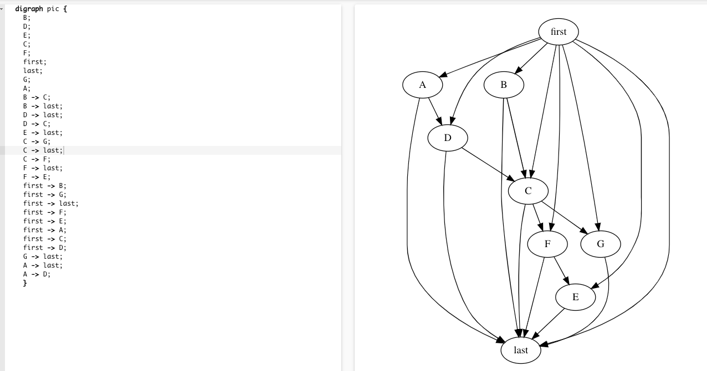

# TaskGraph

简体中文 | [English](./README_EN.md)


这是一个面向Android开发的依赖任务启动框架，致力于帮助广大Android开发者降低开发成本，它可以使用在启动优化中。

## 引用

[](https://search.maven.org/artifact/io.github.jonanorman.android/taskgraph)

```
implementation('io.github.jonanorman.android:taskgraph:0.1.0')
```

## 使用
### 初始化

```Java
TaskGraphModule.initApplication(appliction);
```

### 构建

```Java
TaskGraph.Builder graphBuilder = new TaskGraph.Builder();
graphBuilder.addTask(new Task.Builder("A",new Runnable() {
    @Override
    public void run() {
    }
}));
graphBuilder.addTask(new Task.Builder("B",new Runnable() {
    @Override
    public void run() {
    }
}).dependsOn("A").setMainThread(true));
TaskGraphExecutor.getDefault().execute(graphBuilder);
```


### 日志

默认的日志Tag是TASK_GRAPH_LOG，搜索TASK_GRAPH_LOG: graphviz:会输出任务的graphviz的有向图日志，复制到 [graphviz-visual-editor](http://magjac.com/graphviz-visual-editor/) 可视化查看



### 运行跟踪

```shell
python systrace.py -o trace.html  -a packagename sched
```
packagename要替换成运行的app的包名
chrome浏览器打开chrome://tracing/,load 按钮加载trace.html


## 文档
### Task.Builder 
任务构建器
- setOnlyMainProcess 是否只运行在主进程 默认true
- setRunnable 每个TaskGraph里面的task的runnable不能相同，相同会覆盖 
- setName 设置任务名字，可传可不传，不传日志里面用runnable的class类作为名字
- addTaskCallback 设置任务回调
- removeTaskCallback 移除任务回调
- clearTaskCallback 清除任务回调
- dependsOn 依赖的任务，假设A需要B执行以后才能执行，那么就A.dependsOn(B),可传String、Builder、runnable以及他们的数组
- clearDependsOn 清除依赖

### TaskGraph.Builder
任务图构建器
- addTask 添加任务，传入Task.Builder对象
- removeTask 移除任务
- setFirstTask 设置第一个任务，可传可不传
- setLastTask 设置最后一个任务，可传可不传
- clearTask 清空任务
- addTaskGraphCallback 添加任务图回调
- removeTaskGraphCallback 移除任务图回调
- clearTaskGraphCallback 清空任务图回调
- execute 执行，用TaskGraphExecutor.getDefault()执行，也可以new TaskGraphExecutor()来执行

### TaskGraphExecutor
执行器
- getDefault 默认执行器
- setCoreThreadPoolSize 设置线程池核心数
- setMaximumPoolSize 设置线程池最大数量
- getThreadPoolExecutor 获取线程池
- execute 传入TaskGraph.Builder对象执行

### TaskGraphModule
模块设置器
- isMainProcess 是否是主进程
- getProcessName 获取进程名
- getApplication 获取Application
- initApplication 初始化，在Application的onCreate中调用
- setLogFunction 设置LogFunction
- setEnableTrace 是否开启Systrace跟踪，默认开启
- getPackageName 获取包名
- setLogGraphViz 是否开启输出GraphViz有向图日志，默认开启


## 开源许可证

查看许可证 [LICENSE](./LICENSE).
