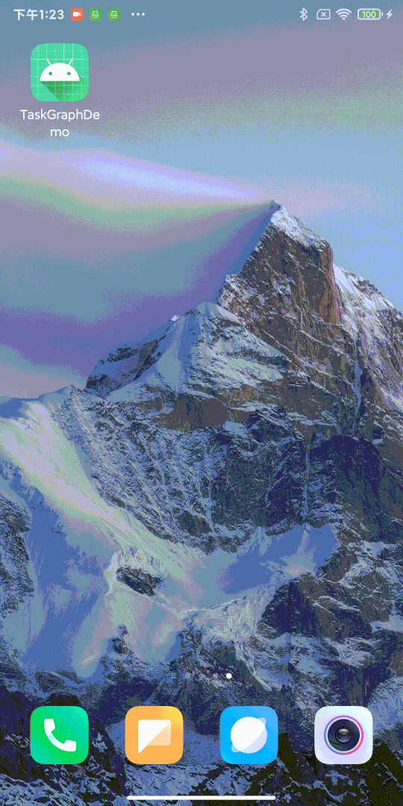
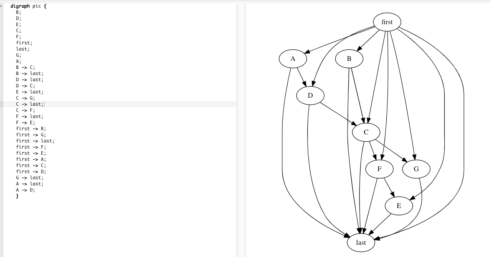

# TaskGraph

English | [简体中文](./README.md)


This is a dependency task startup framework for Android development, dedicated to helping Android developers reduce development costs, and it can be used in startup optimization.

**Ps:**

This English document is translated by google, if you don't understand it, you can submit an issue to me.
## Import

[](https://search.maven.org/artifact/io.github.jonanorman.android/taskgraph)

```
implementation('io.github.jonanorman.android:taskgraph:0.1.0')
```

## Use

### Result




### Init
It must be executed in onCreate of Application, otherwise TaskGraphModule.getTopActivity() will be wrong

```Java
TaskGraphModule.initApplication(appliction);
```

### Execute

```Java
TaskGraph taskGraph = new TaskGraph();
        taskGraph.addTask(new Task("A",new Runnable() {//添加A任务
@Override
public void run() {
        }
        }).addTaskInterceptor(new Task.TaskInterceptor() {
@Override
public void onIntercept(Task.TaskInterceptorChain interceptorChain) {//拦截A任务，在A任务之前可以插入交互性的任务
        interceptorChain.proceed();
        }
        }));
        taskGraph.addTask(new Task("B",new Runnable() {
@Override
public void run() {//添加B任务,B任务依赖A任务先完成
        }
        }).dependsOn("A").setMainThread(true));
        TaskGraphExecutor.getDefault().execute(taskGraph);
```


### Log

The default log tag is TASK_GRAPH_LOG, search for TASK_GRAPH_LOG: graphviz: will output the directed graph log of the task's graphviz, copy it to [graphviz-visual-editor](http://magjac.com/graphviz-visual-editor/) Visual view


### trace

```shell
python systrace.py -o trace.html  -a packagename sched
```
packagename should be replaced with the package name of the running app
Chrome browser open chrome://tracing/, load button to load trace.html


## DOC
### Task
Pass in runnable in the constructor or override the run method of the Task
- **setName**

  Set the task name, which can be passed or not. If it is not passed, the default is to use Task-Num as the name.
- **setMainThread**

  Set whether to run in the main thread, default false
- **setOnlyMainProcess**

  Whether to run only in the main process default true
- **addTaskListener**

  Set the task callback. The doFirst of TaskListener indicates that the task is executed before and after the interception task continues to execute, and doLast indicates that the task is executed after the successful execution.
- **removeTaskInterceptor**

  remove task callback
- **clearTaskInterceptor**

  clear task callback
- **dependsOn**

  Depends on tasks, assuming that B needs to be executed before A can be executed, then B.dependsOn(A), which can pass String, Task and their arrays
- **clearDepends**

  Clear dependencies
- **addTaskInterceptor**

  Add a task interceptor, the onIntercept of TaskInterceptor is executed before the execution of the task, and the cancel method of TaskInterceptorChain is called to cancel the task, then all unexecuted tasks are canceled, and the proceed method of TaskInterceptorChain is called to indicate continued execution, and one of them must be executed, otherwise it will always waiting
- **removeTaskInterceptor**

  remove task interceptor

### TaskGraph

- **addTask**

  add task
- **removeTask**

  remove task
- **setFirstTask**

  Set the first task, which can be passed or not
- **setLastTask**

  Set the last task, which can be passed or not
- **clearTask**

  Clear tasks without clearing FirstTask and LastTask
- **addTaskGraphListener**

  Add task graph callback, onTaskGraphStart of TaskGraphListener means to execute before all tasks are executed, onTaskGraphEnd means to execute after all tasks are executed successfully, onTaskGraphCancel means to execute after task execution is canceled
- **removeTaskGraphListener**

  remove task graph callback
- **clearTaskGraphListener**

  Clear task graph callback
- **execute**

  Execute, use TaskGraphExecutor.getDefault() to execute, or new TaskGraphExecutor() to execute
### TaskGraphExecutor
- **getDefault**

  default executor
- **setCoreThreadPoolSize**

  Set the number of thread pool cores
- **setMaximumPoolSize**

  Set the maximum number of thread pools
- **getThreadPoolExecutor**

  get thread pool
- **execute**

  Pass in the TaskGraph object for execution. If the TaskGraph object changes during execution, the original object settings will still be executed to ensure execution reliability.

### TaskGraphModule
module setter
- **isMainProcess**

  Is it the main process
- **isMainThread**

  Is it the main thread
- **getProcessName**

  get process name
- **getApplication**

  Get Application
- **initApplication**

  Initialization, called in Application's onCreate
- **setLogFunction**

  Set LogFunction
- **setEnableTrace**

  Whether to enable Systrace tracing, enabled by default
- **getPackageName**

  get package name
- **setLogGraphViz**

  Whether to enable the output of GraphViz directed graph logs, enabled by default
- **getTopActivity**

  Get the current topmost Activity
- **runInMainThread**

  Execute in the main thread, if the current thread is the main thread, execute immediately
- **addTopActivityListener**

  Add a listener to listen for changes in the top activity
- **removeTopActivityListener**

  remove listener
- **getRecentActivity**

  Get the latest activity, if it already exists, call back directly in the main thread, if not, wait until there is an activity to return

## License

[LICENSE](./LICENSE).
